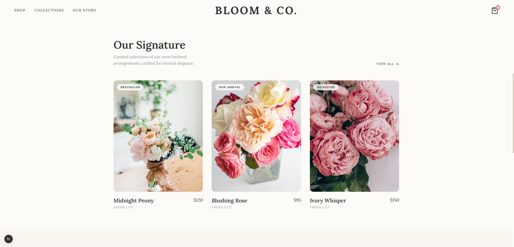

# Bloom & Co.

**A premium e-commerce frontend for a floral boutique — built to explore fluid, animation-heavy UI patterns without sacrificing state management cleanliness.**

This is a frontend showcase project: a full storefront experience (product catalog, cart drawer, product detail pages) with an emphasis on smooth, hardware-accelerated transitions and a cart state architecture that doesn't rely on prop-drilling.

---

## Why This Exists

Most e-commerce demo projects either skip animation entirely (functional but flat) or bolt on animations that cause layout jank and re-render storms. Bloom & Co. was built to answer a specific question: how do you keep a cart drawer, live totals, and page transitions all animated smoothly, while keeping state management simple enough that adding a new page doesn't require threading props through five components?

The answer here is a small, centralized Zustand store for cart state, paired with Framer Motion for transitions — no Redux, no Context provider nesting, no prop drilling.

## Features

- **Product catalog** — image-heavy grid layout with category filtering
- **Cart drawer** — slide-out panel with live quantity/total updates, powered by a global Zustand store (add/remove/update triggers re-renders only in the components that actually display cart data, not the whole tree)
- **Product detail pages** — dynamic routes (`app/products/[slug]/page.tsx`) with animated image transitions between the catalog and detail view
- **Page transitions** — Framer Motion-driven fade/slide transitions between routes
- **Fully responsive** — Tailwind CSS layout tested across mobile, tablet, and desktop breakpoints

## Tech Stack

| Layer | Technology |
|---|---|
| Framework | Next.js (App Router) |
| Styling | Tailwind CSS |
| State Management | Zustand |
| Animation | Framer Motion |
| Icons | Lucide React |

## Screenshots

### Landing Page
<p align="center">
  
</p>

### Product Catalog
<p align="center">
  
</p>

## Getting Started

### Prerequisites
- Node.js 18+

### Setup

```bash
git clone https://github.com/med4ka/bloom-and-co.git
cd bloom-and-co
npm install
npm run dev
```

Visit `http://localhost:3000`.

## Project Structure

```
bloom-and-co/
├── app/
│   ├── page.tsx              # Landing page
│   ├── products/
│   │   ├── page.tsx           # Catalog
│   │   └── [slug]/page.tsx    # Product detail (dynamic route)
│   └── layout.tsx
├── components/
│   ├── cart-drawer.tsx
│   ├── product-card.tsx
│   └── ...
├── store/
│   └── cart-store.ts          # Zustand cart state
└── public/
```

## Known Limitations

This is a frontend-only showcase — there's no backend, no real checkout/payment flow, and product data is static rather than fetched from a CMS or database. It's built to demonstrate UI/animation/state-management patterns, not to run an actual store.

---

*Built with Next.js, Tailwind CSS, and Framer Motion.*
