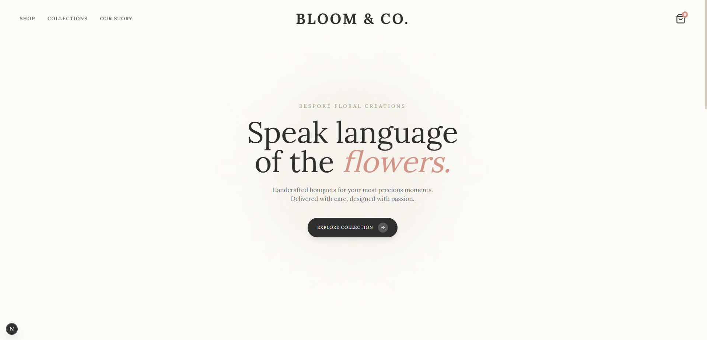

<h1 align="center">🌸 Bloom & Co.</h1>

  <i>Bespoke e-commerce web application designed for a premium floral boutique. Delivering a seamless, elegant, and highly interactive user experience with fluid animations.</i>

  
  
  
  

---

## 📌 Overview

**Bloom & Co.** is a modern, premium frontend showcase engineered to simulate a high-end luxury shopping experience. The application features a dynamic, image-heavy product catalog, an immersive slide-out shopping cart drawer, and fluidly animated product detail pages[cite: 6]. 

The underlying architecture highlights clean, contemporary React patterns, prioritizing lightning-fast layout rendering and scale-ready global state management without the computational overhead of prop-drilling[cite: 6].

---

## ✨ Key Features

* ⚡ **Global Cart State:** Implemented lightweight and highly optimized state management using Zustand to handle global cart dispatches (adding, removing, and live total calculations) across isolated components without unnecessary tree re-renders[cite: 6].
* 🌊 **Fluid UI/UX Architecture:** Integrated Framer Motion to drive sophisticated hardware-accelerated page transitions, staggered layout animations, and a highly responsive cart interface[cite: 6].
* 🔀 **Dynamic Routing Infrastructure:** Deployed Next.js dynamic routing structures (`page.tsx` utilizing layout params) to generate robust, scalable, and SEO-friendly product detail paths[cite: 6].
* 📱 **Responsive Luxury Design:** A fully adaptive web interface crafted with Tailwind CSS to maintain structural elegance across mobile, tablet, and ultra-wide desktop viewports[cite: 6].

---

## 📸 Studio Showroom

### 1. Luxury Landing Page
*Immersive entry viewport featuring elegant typography, minimalist composition, and high-end branding.*

  

### 2. Premium Product Catalog
*Interactive grid layout showcasing premium floral arrangements with active state filtration systems.*

  

---

## 🛠️ Tech Stack

* **Framework:** Next.js (App Router Architecture) & React[cite: 6]
* **Styling:** Tailwind CSS (Utility-first bespoke layout tokens)[cite: 6]
* **State Management:** Zustand (Global cart engine)[cite: 6]
* **Animation Engine:** Framer Motion[cite: 6]
* **Icons:** Lucide React[cite: 6]

---

## 🚀 Local Development Setup

Follow these protocols to clone and initialize the production environment instance locally[cite: 6]:

### 1. Environment Setup & Dependency Installation

* git clone [https://github.com/med4ka/bloom-and-co.git](https://github.com/med4ka/bloom-and-co.git)
* cd bloom-and-co
* npm install

### 2. Execute Production Server
* npm run dev
